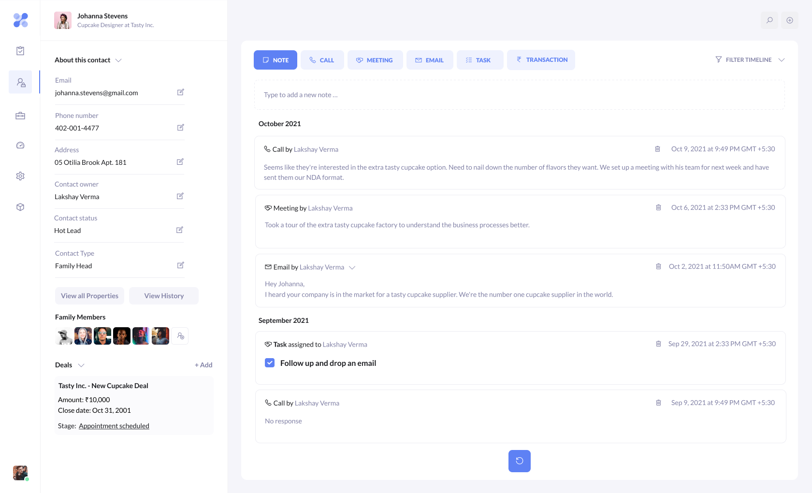
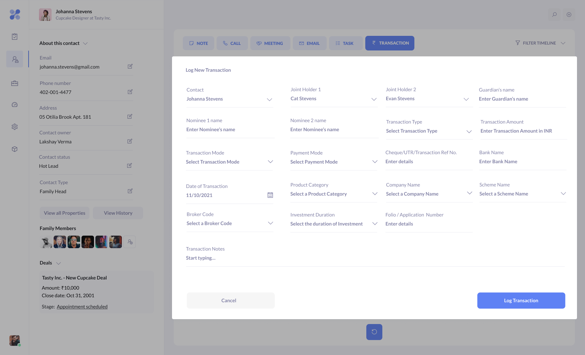
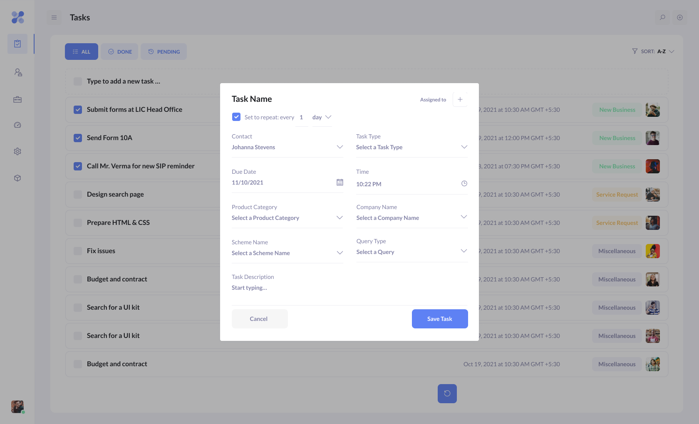

<h1 align="center">Plutus</h1>

<p align="center">
  <strong>A modern CRM built for Indian financial advisors</strong><br>
  Manage clients, track every interaction, and surface business insights — all in one place.
</p>

<p align="center">
  <a href="https://opensource.org/licenses/Apache-2.0"></a>
  
  
  
  
</p>

---

## Overview

**Plutus** is the web client for a CRM tailored to the workflows of Indian financial
advisors and wealth-management firms. It centralises client relationships — contact
profiles, family/household groupings, activity timelines, audit history, and life-event
reports — so advisors can spend less time on admin and more time with clients.

This repository contains the **React single-page front end**. It talks to the Plutus
backend API over HTTP (multi-tenant, JWT-authenticated), which lives in its own
companion repository: [**plutus-backend**](https://github.com/lakshverma/plutus-backend).
In development the front end proxies API calls to `http://localhost:3003`
(see [Connecting to the backend](#connecting-to-the-backend)).

> **Note:** Plutus is currently **desktop-first**. Viewports narrower than `768px`
> are shown a "screen not supported" message rather than the app.

## Table of Contents

- [Screenshots](#screenshots)
- [Features](#features)
- [Tech Stack](#tech-stack)
- [Architecture](#architecture)
- [Project Structure](#project-structure)
- [Getting Started](#getting-started)
- [Available Scripts](#available-scripts)
- [Connecting to the backend](#connecting-to-the-backend)
- [Authentication & Roles](#authentication--roles)
- [API Reference](#api-reference)
- [Roadmap](#roadmap)
- [Known Limitations](#known-limitations)
- [Contributing](#contributing)
- [Project Status](#project-status)
- [License](#license)

## Screenshots

> Some screens below preview UI that is still being built out (see [Roadmap](#roadmap)).

| Contact Profile | Transactions (planned) | Tasks (planned) |
| :---: | :---: | :---: |
|  |  |  |

You can also explore the original [Figma prototype](https://www.figma.com/proto/XCujR4jGAC3dMhzebz2Xch/Plutus-CRM?node-id=0%3A1302&scaling=scale-down&page-id=0%3A821&starting-point-node-id=0%3A1302).

## Features

### 🔐 Authentication & access control
- Email/password sign-in with "remember me" and inline error feedback.
- Full **password recovery** flow: request reset → confirmation screen → reset via a tokenised link.
- **JWT** stored in `localStorage`; the token is decoded client-side and expired
  sessions are logged out automatically with a toast notification.
- **Role-based access control** — protected routes are gated by a `RequireAuth` guard.

### 👥 Contacts
- **Paginated, sortable** contact list with **batch delete**.
- **Rich create-contact form** organised into *Personal*, *Correspondence*, *Financial*,
  and *Other* sections, with:
  - Household / **group-head relationships** (link contacts into a family group).
  - **Indian phone-number validation** via `libphonenumber-js`.
  - **Async, type-ahead dropdowns** for cities, contact owners, types, statuses, and more.
- **Contact profile** with **inline field editing** (with confirmation), family members,
  and a deals panel (preview).
- **Activity timeline** with cursor-based pagination and type filtering — **notes and
  calls** support full create / edit / delete today.

### 🕓 Audit history
- Per-contact **change history**, grouped by month and searchable.
- Human-readable diffs ("*Updated Contact Status from X to Y*") for both property
  changes and activity changes (created / updated / deleted).

### 🏠 Dashboard (Home)
- Time-aware greeting plus headline stats (total contacts, active clients).
- **Quick actions** (add contact, view contacts, generate report, settings) and a
  **recent-activity** feed.

### 📊 Reports
- **Birthday / Anniversary report** — query by a specific day or a whole month, and
  filter by event type, with results linking back to contact profiles.

### 🔎 Global search
- Debounced, app-wide search dialog (built on Radix UI) for contacts, activities, and tasks.

### ⚙️ Settings
- **Users & Teams** — list users, **invite new users**, and **change roles**
  (Admin / Standard / Limited).

## Tech Stack

| Area | Choice |
| --- | --- |
| Framework | [React 17](https://react.dev/) (Create React App / `react-scripts` 5) |
| State management | [Redux Toolkit](https://redux-toolkit.js.org/) + React Redux |
| Routing | [React Router](https://reactrouter.com/) v6 |
| Forms & validation | [Formik](https://formik.org/) + [Yup](https://github.com/jquense/yup) |
| Styling | [Tailwind CSS](https://tailwindcss.com/) 3 + `@tailwindcss/forms` |
| HTTP client | [Axios](https://axios-http.com/) |
| UI primitives | [Radix UI Dialog](https://www.radix-ui.com/), [react-select](https://react-select.com/), [react-datepicker](https://reactdatepicker.com/), [react-spinners](https://www.davidhu.io/react-spinners/) |
| Notifications | [react-toastify](https://fkhadra.github.io/react-toastify/) |
| Utilities | `jwt-decode`, `libphonenumber-js`, `date-fns`, `lodash` |
| Icons / fonts | [Line Awesome](https://icons8.com/line-awesome) (CDN) · Lato |
| Linting | ESLint with the [Airbnb config](https://github.com/airbnb/javascript) |

## Architecture

Plutus follows a **feature-sliced** architecture. Code is grouped by domain feature
rather than by technical type, which keeps related UI, state, and API logic together
and makes features easy to reason about in isolation.

- **Feature modules** (`src/features/*`). Each feature owns its components and, where
  needed, a Redux slice (`*Slice.js`) and an API service (`*Service.js`). Cross-cutting
  building blocks live in `src/common/`.
- **Service layer per feature.** All network access goes through a thin Axios service
  module (e.g. `ContactService.js`). Components never call Axios directly, which keeps
  request shaping, auth headers, and error normalisation in one place.
- **Multi-tenancy by URL.** Authenticated requests are namespaced by the logged-in
  user's tenant, e.g. `GET /{tenant}/contacts`. The tenant is read from the persisted
  user object on each call.
- **Stateless auth.** The JWT is the source of truth. `userService` persists the user
  to `localStorage` and attaches `Authorization: Bearer <token>` to requests; route
  guards decode the token to detect expiry without a server round-trip.
- **Redux for shared state only.** Global concerns (auth session, search, dropdown
  option caches, settings, reports) live in the store; transient screen state stays
  local with React hooks.
- **Composable layout.** `AppLayout` (sidebar nav + content header + optional contextual
  sidebar) is shared across every authenticated screen, so individual features only
  supply their body, header text, and action buttons.

### Request / data flow

```
Component ──dispatch / call──▶ Service (Axios)  ──HTTP──▶  Backend API (:3003)
    ▲                              │
    │                              ├─ attaches JWT (Bearer) + tenant prefix
    └──── Redux store ◀── slice ◀──┘  (for shared/global state)
```

## Project Structure

```text
plutus/
├── public/                 # CRA static shell (index.html, icons, manifest)
├── assets/                 # README screenshots
├── src/
│   ├── index.js            # App entry — Redux Provider + Router + StrictMode
│   ├── app/
│   │   ├── App.js          # Route definitions (public + protected)
│   │   ├── store.js        # Redux store configuration
│   │   └── rootReducer.js  # Combines all feature reducers
│   ├── common/             # Shared, feature-agnostic building blocks
│   │   ├── appLayout/      # AppLayout, SideNav, Content header/body
│   │   ├── form/           # TextInput, FormDropdown, DateInput, TimePicker, Button…
│   │   ├── RequireAuth.js  # Route guard (auth + role + token expiry)
│   │   ├── ConfirmationDialog.js
│   │   └── …               # Missing (404), Unauthorized, UnsupportedScreen, useDebounce
│   └── features/
│       ├── auth/           # Sign-in, password recovery/reset, auth slice & services
│       ├── contact/        # List, create, profile, activity timeline, history
│       ├── home/           # Dashboard: stats, quick actions, recent activity
│       ├── reports/        # Birthday/anniversary report
│       ├── search/         # Global search dialog
│       └── settings/       # Users & Teams management
├── tailwind.config.js      # Theme tokens (Plutus colour palette, fonts, grid)
├── .eslintrc.yml           # Airbnb ESLint config
└── package.json
```

Each feature folder typically contains:

- **Components** — the screens and UI for that domain.
- **`<feature>Service.js`** — the Axios API layer for that domain.
- **`<feature>Slice.js`** — the Redux Toolkit slice (only where shared state is needed).

## Getting Started

### Prerequisites

- **Node.js ≥ 16** (developed against Node 22 / npm 10).
- A running instance of the **Plutus backend API** (see
  [Connecting to the backend](#connecting-to-the-backend)).

### Installation

```bash
git clone https://github.com/lakshverma/plutus.git
cd plutus
npm install
```

### Running in development

```bash
npm start
```

This starts the CRA dev server at **http://localhost:3000**. API calls are proxied to
the backend at `http://localhost:3003` (configured via the `proxy` field in
`package.json`), so make sure the backend is running there.

### Production build

```bash
npm run build
```

The optimised bundle is emitted to `build/`. In production the dev proxy does **not**
apply — serve the build behind a reverse proxy (or same origin) that forwards API
requests to the backend.

## Available Scripts

| Command | Description |
| --- | --- |
| `npm start` | Run the development server (with hot reload) on port 3000. |
| `npm run build` | Produce a production build in `build/`. |
| `npm test` | Run the CRA test runner (see note below). |
| `npm run eject` | Eject from Create React App. **One-way operation** — avoid unless necessary. |

> **Tests:** the project does not yet ship an automated test suite — `npm test` runs
> the Create React App / Jest runner with no specs present. Contributions adding tests
> are very welcome.

## Connecting to the backend

This repo is **front end only**. The expected backend:

- Is reachable at **`http://localhost:3003`** during development (proxied; configurable
  via the `proxy` field in `package.json`).
- Exposes **multi-tenant**, JWT-authenticated REST endpoints (see [API Reference](#api-reference)).
- Returns a user object on login containing at least a `token` (JWT), a `tenant`
  identifier, a numeric `role`, and profile fields (`username`, `email`).

No `.env` configuration is required for local development beyond pointing the proxy at
your backend, since the client uses **relative** API paths.

## Authentication & Roles

- On successful login the user object (including the JWT) is stored under the
  `loggedPlutusAppUser` key in `localStorage` and loaded into Redux on app start.
- Every protected route is wrapped by **`RequireAuth`**, which:
  1. Redirects unauthenticated users to the sign-in page.
  2. Decodes the JWT and **logs out expired sessions** automatically.
  3. Enforces **role-based access** against an `allowedRoles` list.

Roles are represented numerically by the API and surfaced in **Settings → Users & Teams**:

| Role | ID | Capability (intended) |
| --- | --- | --- |
| Admin | `2` | Full access, including user & role management |
| Standard | `3` | Day-to-day CRM usage |
| Limited | `4` | Restricted access |

## API Reference

The front end expects the following endpoints. `{tenant}` is the logged-in user's tenant
identifier. All authenticated requests send `Authorization: Bearer <jwt>`.

<details>
<summary><strong>Auth</strong></summary>

| Method | Endpoint | Purpose |
| --- | --- | --- |
| `POST` | `/auth/login` | Authenticate, returns the user + JWT |
| `POST` | `/auth/request-pass` | Request a password-reset email |
| `POST` | `/auth/reset-pass` | Reset password (token in `Authorization` header) |

</details>

<details>
<summary><strong>Contacts</strong></summary>

| Method | Endpoint | Purpose |
| --- | --- | --- |
| `GET` | `/{tenant}/contacts` | List contacts (`page`, `sort[n]=col:order`) |
| `POST` | `/{tenant}/contacts` | Create a contact |
| `GET` | `/{tenant}/contacts/{id}` | Fetch a contact |
| `PUT` | `/{tenant}/contacts/{id}` | Update a contact |
| `DELETE` | `/{tenant}/contacts/{id}` | Delete a contact |
| `DELETE` | `/{tenant}/contacts/batch` | Batch delete (`{ contactIds }`) |
| `GET` | `/{tenant}/contacts/options/{type}` | Dropdown options (`all`, `cities`, `contact-types`, `contact-owners`, `contact-statuses`, `contact-names`, `groupheads`, …) |
| `GET` | `/{tenant}/contacts/stats/dashboard` | Dashboard stats |

</details>

<details>
<summary><strong>Activities, notes & calls</strong></summary>

| Method | Endpoint | Purpose |
| --- | --- | --- |
| `GET` | `/{tenant}/contacts/{id}/activities` | Activity timeline (cursor paginated) |
| `POST` / `PUT` / `DELETE` | `/{tenant}/contacts/{id}/notes[/{noteId}]` | Manage notes |
| `POST` / `PUT` / `DELETE` | `/{tenant}/contacts/{id}/calls[/{callId}]` | Manage calls |
| `GET` | `/{tenant}/activities/options` | Activity option lists (e.g. call outcomes) |
| `GET` | `/{tenant}/activities/recent` | Recent activity feed |
| `GET` | `/{tenant}/audit/contact/{id}` | Contact change history |

</details>

<details>
<summary><strong>Reports, search & users</strong></summary>

| Method | Endpoint | Purpose |
| --- | --- | --- |
| `GET` | `/{tenant}/report/life-events` | Birthdays/anniversaries (`month`, `day?`, `type?`) |
| `GET` | `/{tenant}/search?q=` | Global search |
| `GET` | `/{tenant}/auth/users` | List users |
| `POST` | `/{tenant}/auth/signup` | Create a user |
| `PATCH` | `/{tenant}/auth/users/{id}/role` | Update a user's role |

</details>

## Roadmap

Items below are scaffolded in the UI (often as disabled "coming soon" controls) and are
the natural next steps:

- [ ] **Deals / pipeline** management (currently a static preview on the contact profile).
- [ ] **More activity types** — meetings, emails, tasks, and transactions
      (notes and calls are live today).
- [ ] **More reports** — age-wise, income-range, employer-wise, profession-wise,
      family investment, and client-activity lists.
- [ ] **Export reports to PDF.**
- [ ] **Dashboard expansion** — pending-tasks and monthly-revenue cards.
- [ ] **Settings expansion** — General Information and Billing tabs.
- [ ] **Mobile / responsive** support.

## Known Limitations

- **Desktop only.** Screens narrower than `768px` render an unsupported-screen notice.
- **Deals are a static preview** — the panel shows placeholder data and is not yet wired
  to the backend.
- **Limited activity types.** Only notes and calls are fully editable; other activity
  types appear in the timeline but cannot yet be created/edited from the UI.
- **PDF export** for reports is not implemented yet.
- **Search error handling** treats any failed search as a session expiry and routes back
  to sign-in.
- **No automated tests** are present yet.

## Contributing

Contributions are welcome! To keep history clean, please follow the project conventions:

- **Lint** before committing: the project uses the Airbnb ESLint config.
  ```bash
  npx eslint src/
  ```
- **Commit messages** follow [Conventional Commits](https://www.conventionalcommits.org/):
  ```text
  <type>(<scope>): <subject>

  [optional body explaining WHY]
  [optional footer, e.g. Fixes #123]
  ```
  Use a lower-case, imperative subject (≤ ~50 chars) and a `type` of `feat`, `fix`,
  `docs`, `style`, `refactor`, `perf`, `test`, or `chore`. The `scope` names the area
  affected (e.g. `auth`, `contact`, `reports`).

Typical workflow: fork → branch → make changes (lint clean) → open a pull request with a
clear description.

## Project Status

Plutus is in **active development** (pre-alpha). Core flows — authentication, contact
management, activity logging, audit history, the dashboard, reporting, and user
management — are functional against a compatible backend, while several features remain
on the [roadmap](#roadmap).

- [x] UI mockup — [live prototype](https://www.figma.com/proto/XCujR4jGAC3dMhzebz2Xch/Plutus-CRM?node-id=0%3A1302&scaling=scale-down&page-id=0%3A821&starting-point-node-id=0%3A1302)
- [x] Database design — [model screenshot](https://drive.google.com/file/d/1wWch6KY5_NCG8XFYC8PkDfBcgE-53xlY/view?usp=sharing)
- [x] Core front-end features (auth, contacts, activities, reports, settings)
- [ ] Pre-alpha release

## License

Distributed under the **Apache License 2.0**. See [`LICENSE`](LICENSE) for details.
